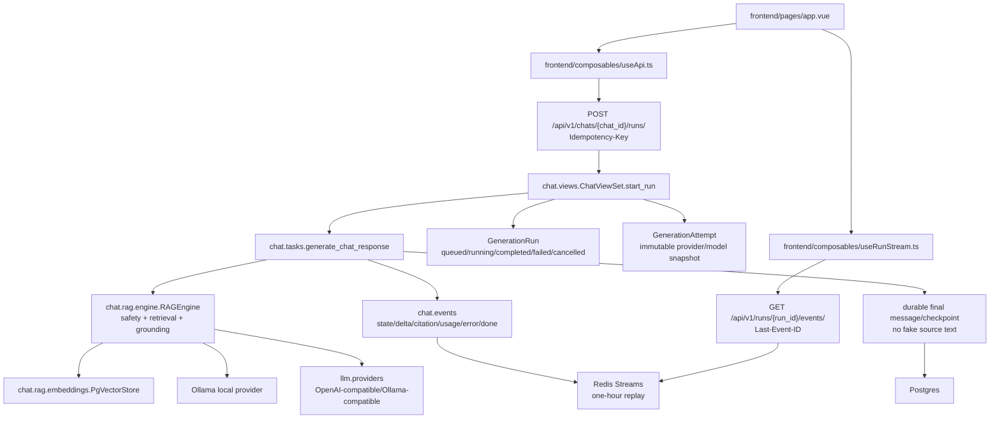
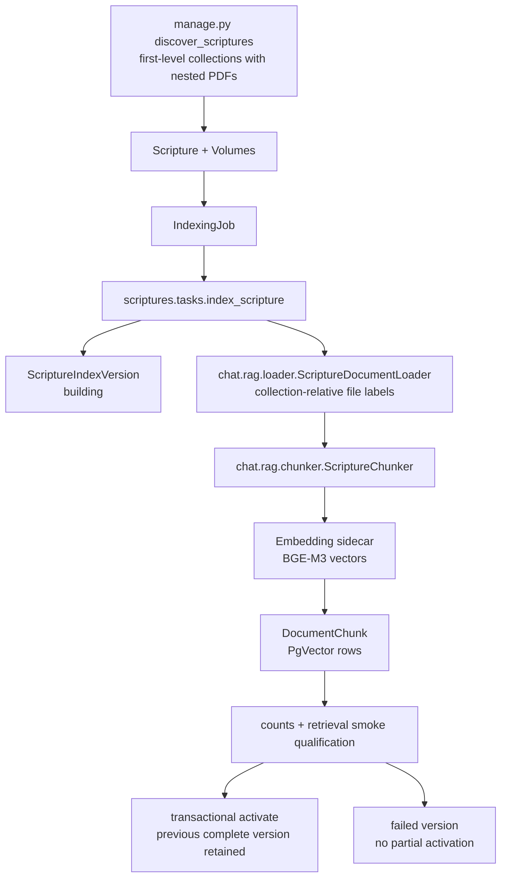
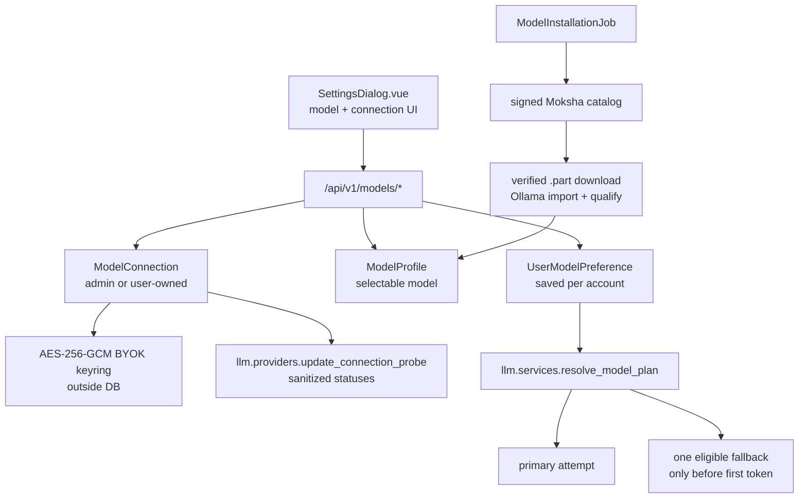

# Moksha AI Project Graph

Generated from source inspection at commit `e3f349f`, with stale
`graphify-out/` hub data used only as navigation hints. The `graphify` CLI was
not available in this shell, so this file is the current compact graph for
handoff and token-saving.

## Service Topology

```mermaid
graph LR
    Browser["Browser\nsession cookie + CSRF"] --> Caddy["Caddy\nonly published HTTPS edge"]
    Caddy -->|"/api/v1/* /admin/* /static/*"| Django["Django 6 + DRF\nASGI via Uvicorn"]
    Caddy -->|"all other routes"| Nuxt["Nuxt 4 + Vue 3\nSSR product UI"]

    Django --> Postgres["PostgreSQL + PgVector\nproduct + retrieval state"]
    Django --> Redis["Redis\nbroker + typed stream replay"]
    Django --> Embedding["Private FastAPI embedding sidecar\nsingle BGE-M3 owner"]
    Django --> Ollama["Windows-host Ollama\nlocal generation"]
    Django --> Providers["User BYOK providers\npublic HTTPS only"]

    CeleryGen["Celery generation worker\nqueue: generation"] --> Django
    CeleryGen --> Redis
    CeleryGen --> Postgres
    CeleryGen --> Ollama
    CeleryGen --> Providers

    CeleryIndex["Celery indexing worker\nqueue: indexing"] --> Embedding
    CeleryIndex --> Postgres
    CeleryOps["Celery operations worker\nqueue: operations"] --> Postgres
    Installer["Celery model installer\nqueue: model-installation"] --> Ollama
```

## Chat Run Flow

## Scripture Indexing Flow

## Model Platform Flow

## High-Value Navigation Nodes

- `chat/models.py`: `Chat`, `Message`, `DocumentChunk`, `GenerationRun`,
  `GenerationAttempt`.
- `chat/tasks.py`: generation lifecycle, fallback, stream publishing, sanitized
  failure handling.
- `chat/events.py`: typed Redis Stream events and replay.
- `chat/rag/engine.py`: safety routing, retrieval, grounded answer enforcement.
- `chat/citations.py`: validated citation JSON and fail-closed source handling.
- `scriptures/tasks.py`: immutable candidate index, qualification, activation,
  rollback retention.
- `llm/models.py`: connections, profiles, preferences, hardware, catalog,
  installation jobs.
- `llm/providers.py`: public HTTPS provider guardrails, probes, streaming
  adapters, sanitized provider failures.
- `frontend/pages/app.vue`: authenticated app shell, chat workspace, status,
  settings entrypoint.
- `frontend/components/app/SettingsDialog.vue`: theme, model, BYOK connection,
  scripture/account controls.
- `frontend/composables/useApi.ts`: REST client schemas and account persistence.
- `frontend/composables/useRunStream.ts`: hand-written SSE adapter.
- `scripts/live_ui_walkthrough.py`: Playwright UI proof with mock API.

## Current Verification Gaps

- Docker daemon is not reachable in this shell, so Compose, PgVector, Redis,
  Celery, Caddy, and real indexing smoke remain externally blocked locally.
- `graphify-out/` was built from older commit `fe9e97e0`; regenerate with
  `graphify update .` when that CLI is available.
- Legacy Streamlit still exists behind `legacy-streamlit` Compose profile until
  production parity and rollback gates are fully proven.
